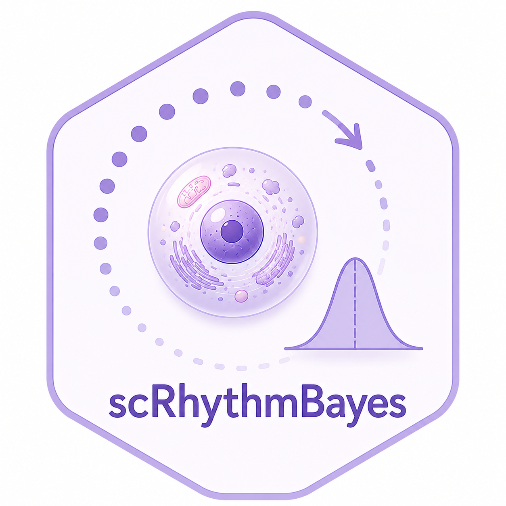
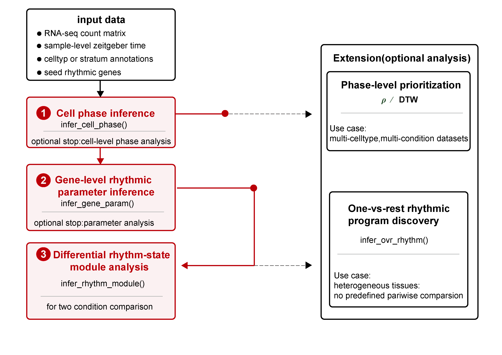

# scRhythmBayes 

[](https://github.com/Liwei-DynamicsLab/scRhythmBayes/actions/workflows/R-CMD-check.yaml)

**Cell-level circadian phase inference and rhythm-state remodeling for single-cell transcriptomes**

`scRhythmBayes` is an R package for phase-resolved circadian analysis in heterogeneous single-cell transcriptomic data.

The package is designed to infer latent cell-level circadian phase, estimate gene-level rhythmic parameters, and characterize condition- and cell-type-resolved rhythm-state remodeling. It provides a core workflow for cell phase inference, rhythmic parameter estimation, and differential rhythm-state module analysis, together with extension analyses for one-vs-rest rhythmic program discovery, DTW-based phase-distribution similarity, and circular phase-concentration rho analysis.

<p align="center">
  
</p>

## Overview

`scRhythmBayes` organizes single-cell circadian analysis into one core workflow and several extension workflows.

### Core workflow

The core workflow follows the main analysis logic of the method:

1. **Cell-level circadian phase inference**  
   Infer latent circadian phase for each cell from seed rhythmic genes.

2. **Gene-level rhythmic parameter inference**  
   Estimate rhythmic parameters, including mesor, mean expression, amplitude, phase, dropout rate, likelihood-ratio statistics, and FDR.

3. **Differential rhythm-state module analysis**  
   Classify genes into interpretable rhythm-state remodeling modules between two biological conditions.

### Extension analyses

Additional analysis branches are provided for heterogeneous or multi-cell-type datasets:

1. **One-vs-rest rhythmic program discovery**  
   Identify cell-type-specific rhythmic programs by comparing one target cell type against all remaining cell types.

2. **DTW-based phase-distribution similarity analysis**  
   Compare circular cell-phase distributions across celltype-by-condition combinations.

3. **Circular phase-concentration rho analysis**  
   Summarize the concentration of inferred cell phases within cell types, groups, and optional sample-level units.

## Installation

The package can be installed from GitHub:

```r
install.packages("remotes")
remotes::install_github("Liwei-DynamicsLab/scRhythmBayes")
```

Load the package:

```r
library(scRhythmBayes)
```

Check the installed version:

```r
packageVersion("scRhythmBayes")
```

Note: if the GitHub repository is private, installation requires GitHub authentication and repository access.

## Example data

`scRhythmBayes` includes an example dataset for testing the complete workflow.

```r
data("srb_example_data")

names(srb_example_data)
dim(srb_example_data$Count)
class(srb_example_data$Count)
dim(srb_example_data$meta)
head(srb_example_data$meta)
```

Example output:

```text
[1] "Count" "meta"

[1] 1000 4000

[1] "dgCMatrix"
attr(,"package")
[1] "Matrix"

[1] 4000    6

               cell ZT celltype condition     T_true Theta_true
Cell00001 Cell00001  0        1         A 23.3400755  6.1104175
Cell00002 Cell00002  0        1         B 23.7670342  6.2221950
Cell00003 Cell00003  0        1         B  0.9221928  0.2414295
Cell00004 Cell00004  0        1         B  1.9315598  0.5056812
Cell00005 Cell00005  0        1         A  0.9730132  0.2547343
Cell00006 Cell00006  0        1         A  1.1848616  0.3101960
```

The example object contains:

| Object | Description |
|---|---|
| `srb_example_data$Count` | Gene-by-cell sparse count matrix with 1,000 genes and 4,000 cells |
| `srb_example_data$meta` | Cell-level metadata containing cell ID, sampling time, cell type, condition, and simulated true phase |

Metadata columns:

| Column | Description |
|---|---|
| `cell` | Cell identifier matched to the count matrix column names |
| `ZT` | Sampling Zeitgeber time |
| `celltype` | Simulated cell-type label |
| `condition` | Simulated group or condition label |
| `T_true` | Simulated true circadian time in hours |
| `Theta_true` | Simulated true circadian phase in radians |

`T_true` and `Theta_true` are available only in the simulated example dataset and are used for demonstration and validation. Real single-cell datasets usually do not contain these two columns.

Basic input objects:

```r
count <- srb_example_data$Count
metadata <- srb_example_data$meta
```

## Core workflow

### 1. Infer cell-level circadian phase

```r
res_phase <- infer_cell_phase(
  count = srb_example_data$Count,
  metadata = srb_example_data$meta,
  ZT_by = "ZT",
  strata_by = "celltype",
  Species = "mouse",
  setseed = 1,
  Verbose = FALSE
)

head(res_phase)
```

Example output:

```text
# A tibble: 6 × 7
  cell      ZT_input stratum theta_pred ZT_pred  Rbar r_cell
  <chr>        <dbl> <chr>        <dbl>   <dbl> <dbl>  <dbl>
1 Cell00001        0 1           0.0444   0.169 0.999  0.999
2 Cell00002        0 1           6.21    23.7   0.979  0.998
3 Cell00003        0 1           0.570    2.18  0.994  0.998
4 Cell00004        0 1           0.829    3.17  0.991  0.990
5 Cell00005        0 1           6.26    23.9   0.995  0.999
6 Cell00006        0 1           0.553    2.11  0.998  0.999
```

Example output columns:

| Column | Description |
|---|---|
| `cell` | Cell barcode or cell ID |
| `ZT_input` | Observed sampling Zeitgeber time |
| `stratum` | Stratum used during phase inference |
| `theta_pred` | Inferred cell-level circadian phase in radians |
| `ZT_pred` | Inferred cell-level circadian phase converted to 24-hour time |
| `Rbar` | Aggregate phase concentration statistic |
| `r_cell` | Cell-level phase reliability weight |

### 2. Estimate gene-level rhythmic parameters

For a basic condition-comparison example, the gene-level model can be run within one cell type.

```r
cell_use <- as.character(srb_example_data$meta$celltype) == "1"

res_param <- infer_gene_param(
  count = srb_example_data$Count[, cell_use, drop = FALSE],
  metadata = srb_example_data$meta[cell_use, , drop = FALSE],
  theta_pred = res_phase$theta_pred[cell_use],
  r_cell = res_phase$r_cell[cell_use],
  strata_by = "condition",
  B = 10,
  n_worker = 1,
  setseed = 1,
  Verbose = FALSE
)

head(res_param$param_long)
head(res_param$param_wide)
```

Main outputs:

| Output | Description |
|---|---|
| `param_long` | Long-format gene-level rhythmic parameter estimates for each group |
| `param_wide` | Wide-format paired parameter table for downstream module analysis |
| `bootstrap_res` | Optional bootstrap confidence interval results |

Common gene-level parameters include:

| Column | Description |
|---|---|
| `gene` | Gene name |
| `Mesor` | Baseline rhythmic expression level |
| `Mean` | Mean expression level |
| `Amplitude` | Circadian oscillation amplitude |
| `Phase` | Gene-level rhythmic phase in radians |
| `Alpha` | Dispersion-related parameter |
| `Dropout_rate` | Estimated dropout rate |
| `LRT_stat` | Likelihood-ratio test statistic |
| `P_value` | Nominal rhythmicity test P value |
| `FDR` | Multiple-testing adjusted rhythmicity significance |

### 3. Infer differential rhythm-state modules

```r
res_module <- infer_rhythm_module(
  param_wide = res_param$param_wide,
  compare_by = "condition",
  group1 = "A",
  group2 = "B",
  out_dir = NULL,
  Verbose = FALSE
)

head(res_module$module_result)
```

Example output:

```text
# A tibble: 6 × 27
  gene   compare_by group1 group2     FDR_A     FDR_B Amplitude_A Amplitude_B Phase_A Phase_B delta_phi_rad
  <chr>  <chr>      <chr>  <chr>      <dbl>     <dbl>       <dbl>       <dbl>   <dbl>   <dbl>         <dbl>
1 Cdkn1a condition  A      B      9.80e- 79 1.51e- 59        2.59        2.76    3.72    3.77       0.0473
2 Mmp14  condition  A      B      9.17e- 63 4.54e- 55        3.03        2.80    3.98    4.06       0.0742
3 Clock  condition  A      B      6.84e-143 3.48e-119        3.67        3.50    6.04    5.99      -0.0541
4 Per2   condition  A      B      5.74e- 67 8.81e- 58        2.72        2.28    3.40    3.40      -0.00221
5 Per1   condition  A      B      3.10e- 53 1.02e- 44        2.51        2.46    4.72    4.76       0.0322
6 Bmal1  condition  A      B      1.43e- 16 3.39e- 21        2.54        3.01    1.34    1.31      -0.0251
```

The module analysis assigns genes to interpretable rhythm-state remodeling classes based on rhythmicity, amplitude remodeling, and phase remodeling between two groups.

### 4. Visualize rhythm-state modules

```r
hm_module <- plot_module_heatmap(
  count = srb_example_data$Count[, cell_use, drop = FALSE],
  res_phase = res_phase[cell_use, , drop = FALSE],
  gene_meta = res_module$module_result,
  metadata = srb_example_data$meta[cell_use, , drop = FALSE],
  group_by = "condition",
  group1 = "A",
  group2 = "B"
)

hm_module
plot(hm_module, module_id = 0)
```

```r
p_polar <- plot_module_polar(
  gene_meta = res_module$module_result,
  module_id = 7,
  group1 = "A",
  group2 = "B"
)

p_polar$plot
```

## Extension workflow 1: one-vs-rest rhythmic program discovery

The one-vs-rest branch is designed for heterogeneous tissues or multi-cell-type datasets. It compares each target cell type against all remaining cell types to identify cell-type-specific rhythmic programs.

```r
res_ovr_param <- infer_gene_param(
  count = srb_example_data$Count,
  metadata = srb_example_data$meta,
  theta_pred = res_phase$theta_pred,
  r_cell = res_phase$r_cell,
  strata_by = "celltype",
  B = 10,
  n_worker = 1,
  setseed = 1,
  Verbose = FALSE
)

res_ovr <- infer_ovr_rhythm(
  param_long = res_ovr_param$param_long,
  group_by = "celltype",
  q_cut = 0.05,
  amp_cut = 0.25,
  Verbose = FALSE
)

head(res_ovr$ovr_result)
```

Example output:

```text
    gene TargetCellType RestCellTypes rhythm_pattern    FDR_group1    FDR_group2 Mean_group1 Mean_group2 Amplitude_group1
1 Cdkn1a              1         2,3,4          Other 4.906370e-135 7.512171e-145   0.9727523   0.6754654         2.686816
2  Mmp14              1         2,3,4          Other 2.205527e-114 2.929127e-116   0.5518791   0.6751436         2.874521
3  Clock              1         2,3,4          Other 1.837581e-294 7.247446e-124   0.6533396   0.7569091         3.604569
4   Per2              1         2,3,4          Other 2.542876e-123 1.088094e-130   0.8148060   1.1573551         2.487120
5   Per1              1         2,3,4          Other  2.759640e-97 6.822243e-166   0.7445542   0.9958452         2.457057
6  Bmal1              1         2,3,4          Other  3.691279e-37  4.777116e-95   0.0962345   0.3231072         2.737424
```

Visualize one-vs-rest rhythmic programs:

```r
ht_ovr <- plot_ovr_heatmap(
  count = srb_example_data$Count,
  res_phase = res_phase,
  ovr_result = res_ovr$ovr_result,
  metadata = srb_example_data$meta,
  celltype_by = "celltype",
  Verbose = FALSE
)

ht_ovr
plot(ht_ovr)
```

Main output columns:

| Column | Description |
|---|---|
| `gene` | Gene name |
| `TargetCellType` | Target cell type |
| `RestCellTypes` | Pooled non-target cell types |
| `rhythm_pattern` | One-vs-rest rhythm-state pattern |
| `FDR_group1` | Rhythmicity FDR in the target group |
| `FDR_group2` | Rhythmicity FDR in the rest group |
| `Mean_group1`, `Mean_group2` | Mean expression in target and rest groups |
| `Amplitude_group1`, `Amplitude_group2` | Rhythmic amplitude in target and rest groups |
| `Phase_group1`, `Phase_group2` | Rhythmic phase in target and rest groups |
| `Delta_Mean` | Target-minus-rest mean difference |
| `Delta_Amp` | Target-minus-rest amplitude difference |
| `target_specific_flag` | Whether the gene is classified as target-specific |

## Extension workflow 2: DTW-based phase-distribution similarity

The DTW branch compares circular phase distributions between celltype-by-condition combinations.

```r
dtw_res <- run_dtw_similarity(
  res_phase = res_phase,
  metadata = srb_example_data$meta,
  celltype_by = "celltype",
  group_by = "condition",
  min_cell = 10,
  Verbose = FALSE
)

dtw_res
head(dtw_res$histogram)
dtw_res$similarity
```

Example histogram output:

```text
  combo cell_type Group bin bin_start   bin_end   bin_mid       prop
1 1 | A         1     A   1 0.0000000 0.2617994 0.1308997 0.07370518
2 1 | A         1     A   2 0.2617994 0.5235988 0.3926991 0.05179283
3 1 | A         1     A   3 0.5235988 0.7853982 0.6544985 0.03784861
4 1 | A         1     A   4 0.7853982 1.0471976 0.9162979 0.02589641
5 1 | A         1     A   5 1.0471976 1.3089969 1.1780972 0.07370518
6 1 | A         1     A   6 1.3089969 1.5707963 1.4398966 0.03585657
```

Example similarity matrix:

```text
           1 | A     1 | B     2 | A     2 | B     3 | A      3 | B     4 | A     4 | B
1 | A 1.00000000 0.5258293 0.5254280 0.5121285 0.3678544 0.01576747 0.3168803 0.6216232
1 | B 0.52582928 1.0000000 0.2482149 0.3303387 0.2933876 0.00000000 0.1401936 0.3610806
2 | A 0.52542801 0.2482149 1.0000000 1.0000000 0.2476438 0.25802896 0.2154369 0.5784490
2 | B 0.51212846 0.3303387 1.0000000 1.0000000 0.5154377 0.58143845 0.1062025 0.5468284
3 | A 0.36785437 0.2933876 0.2476438 0.5154377 1.0000000 0.72335525 0.4392088 0.2753267
3 | B 0.01576747 0.0000000 0.2580290 0.5814384 0.7233553 1.00000000 0.1779542 0.4694300
```

Plot DTW similarity heatmap:

```r
ht_dtw <- plot_dtw_heatmap(
  dtw_res = dtw_res
)

ht_dtw
plot(ht_dtw)
```

Main outputs:

| Output | Description |
|---|---|
| `data` | Merged cell-level phase and metadata table |
| `histogram` | Circular phase histogram for each celltype-by-group combination |
| `distance` | Pairwise DTW distance matrix |
| `similarity` | Scaled 0-to-1 DTW similarity matrix |
| `annotation` | Annotation table for heatmap rows and columns |

## Extension workflow 3: circular phase-concentration rho analysis

The rho branch summarizes how concentrated inferred cell phases are within each cell type and condition.

### Group-level rho summary

```r
rho_res <- run_phase_rho(
  res_phase = res_phase,
  metadata = srb_example_data$meta,
  celltype_by = "celltype",
  group_by = "condition",
  theta_by = "theta_pred",
  group_levels = c("A", "B"),
  min_cell = 10,
  Verbose = FALSE
)

rho_res
```

Plot rho values:

```r
p_rho <- plot_phase_rho(rho_res)
p_rho$plot
```

### Sample-level rho summary

If a sample column is available, `run_phase_rho()` can also summarize rho at the sample level and perform sample-level group comparisons within each cell type.

The example dataset does not contain real biological sample IDs. The following code creates artificial sample labels for demonstration only.

```r
set.seed(1)

meta_rho_test <- srb_example_data$meta

if (!"cell" %in% colnames(meta_rho_test)) {
  meta_rho_test$cell <- rownames(meta_rho_test)
}

meta_rho_test$Sample <- NA_character_

sample_per_group <- 4

split_key <- interaction(
  meta_rho_test$celltype,
  meta_rho_test$condition,
  drop = TRUE
)

for (kk in levels(split_key)) {
  idx <- which(split_key == kk)

  meta_rho_test$Sample[idx] <- sample(
    paste0("S", seq_len(sample_per_group)),
    size = length(idx),
    replace = TRUE
  )
}

rho_res_sample <- run_phase_rho(
  res_phase = res_phase,
  metadata = meta_rho_test,
  celltype_by = "celltype",
  group_by = "condition",
  sample_by = "Sample",
  theta_by = "theta_pred",
  group_levels = c("A", "B"),
  min_cell = 10,
  Verbose = FALSE
)

head(rho_res_sample$rho_sample)
```

Example sample-level rho output:

```text
  cell_type Group Sample n_cell        rho mean_phase_rad mean_phase_hour
1         1     A     S1    138 0.03936473      3.0985686       11.835660
2         1     A     S2    121 0.10892079      0.9783530        3.737033
3         1     A     S3    120 0.12955172      0.3413518        1.303868
4         1     A     S4    123 0.01671531      1.7440895        6.661931
5         1     B     S1    119 0.07526560      1.3112934        5.008772
6         1     B     S2    137 0.14094304      0.2920608        1.115590
```

Plot sample-level rho values:

```r
p_rho_sample <- plot_phase_rho(rho_res_sample)
p_rho_sample$plot
```

## Tutorials

Detailed tutorials are available from the package website.

### Core workflow

- [Basic workflow: from cell phase inference to rhythm-state modules](https://Liwei-DynamicsLab.github.io/scRhythmBayes/articles/basic-workflow.html)

### Extension analyses

- [Rhythm-state module analysis](https://Liwei-DynamicsLab.github.io/scRhythmBayes/articles/module-analysis.html)
- [One-vs-rest rhythmic program discovery](https://Liwei-DynamicsLab.github.io/scRhythmBayes/articles/ovr-analysis.html)
- [DTW and rho phase-prioritization analysis](https://Liwei-DynamicsLab.github.io/scRhythmBayes/articles/phase-prioritization-dtw-rho.html)
### Phase visualization

| Function | Description |
|---|---|
| `plot_phase_scatter()` | Compare inferred phase with sampling time |
| `plot_phase_circle()` | Visualize circular cell-phase distributions |
| `plot_phase_flower()` | Visualize phase distributions by sampling time |
| `plot_phase_rose()` | Plot rose-style phase distributions |

### Extension analyses

| Function | Description |
|---|---|
| `infer_ovr_rhythm()` | Identify one-vs-rest cell-type-specific rhythmic programs |
| `plot_ovr_heatmap()` | Plot one-vs-rest rhythm-state heatmap |
| `run_dtw_similarity()` | Run DTW-based phase-distribution similarity analysis |
| `plot_dtw_heatmap()` | Plot DTW similarity or distance heatmap |
| `run_phase_rho()` | Summarize circular phase concentration rho |
| `plot_phase_rho()` | Plot rho by cell type and group |

## Notes

`scRhythmBayes` is intended for phase-resolved analysis of single-cell transcriptomic datasets where cells are collected across circadian or time-of-day sampling points. The core workflow focuses on latent cell-phase inference and rhythm-state remodeling analysis. The extension workflows support additional biological questions, including cell-type-specific rhythmic program discovery and comparison of inferred phase distributions across cell types and conditions.

The package is under active development. Function interfaces and tutorials may be updated as the manuscript and reproducibility workflows are finalized.

## Citation

If you use `scRhythmBayes`, please cite the associated manuscript:

Zhang Q, Li C, Zhang L. Decoding cell-level circadian phase and rhythm-state remodeling in single-cell transcriptomes with scRhythmBayes.

## License

This package is released under the MIT License.

## Authors

Liwei Zhang, Qian Zhang, and Chenyu Li.

